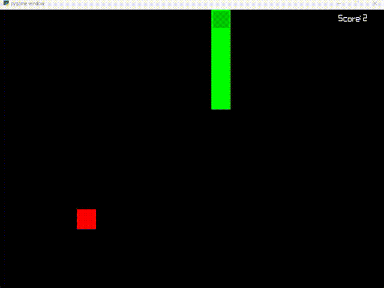
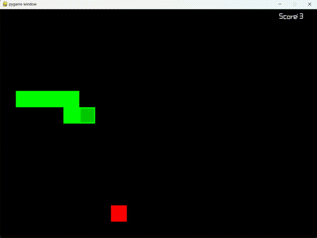

# GluttonousSnake-RL
这是一个使用强化学习玩贪吃蛇的项目。
贪吃蛇环境基于pygame，实现参考了：
https://www.cnblogs.com/dengfaheng/p/9241267.html 
该环境允许游戏设置为变速模式： 
当设置 <code>speedchange=True</code>时
随着时间的推移蛇的速度会逐渐增加。

本文共实现了两种强化学习算法。PPO（在线学习）与SAC(离线学习），并对比了他们的训练效果。

环境的状态参考了https://github.com/ZYunfeii/DRL4SnakeGame。 
环境有一个状态参数<code>state_dim</code> 
当设置为6时，state共有六维
1.蛇头与食物的相对x与y坐标（2维）
2.蛇头上下左右是否有边界（4维） 
设置为10时会额外补充身体的四个状态。

这里仅采用6维状态就可以得到一个较好的模型。策略和价值网络仅由三层全连接网络组成，训练可以在最多4小时内完成。

最终训练结果：(见train.ipynb) 
PPO在1000次迭代后就可以达到收敛，但是可能会出现若干过拟合阶段（在某些episode中reward骤降）。 
SAC达到较好回报的速度更慢一些。但曲线整体走势稳定。

在充分训练后进行测试： 
PPO 
 
可以看到PPO的策略是求稳。在纵向移动时会来回摆动，而不是直接向着食物。而这一策略非常有益于后期生存。 
在后期身体过长且速度加快时，通过来回的摆动可以有效避免撞到身体。除非身体长到来回摆动也无法缓解。 

SAC 
 
而SAC的策略更为直接一些，它会直接奔着食物去，这样做的坏处就是很容易在吃食物时撞到自己的身体,甚至把自己包围，因此一般SAC的得分会低于PPO。 
如果在状态中加入自己的身体信息应该能改善这一状况。
